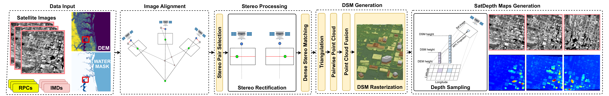

<p align="center">
  <h1 align="center">SatDepth: A Novel Dataset for Satellite Image Matching</h1>
  <p align="center">
  <!-- link to git/linkedin etc -->
    <a href="https://www.linkedin.com/in/rahul-deshmukh-purdue">Rahul Deshmukh</a>
  </p>
  <p align="center">
    <a href="https://arxiv.org/abs/2503.12706">Paper</a> | 
    <a href="https://satdepth.pythonanywhere.com/">Project Page</a>
  </p>
</p>

This repository provides code and resources for the **SatDepth** dataset. Please make sure to visit our project page for visualizations and an interactive demo of the dataset.

<p align="center">
  <table>
    <tr>
      <!-- Left column -->
      <td>
        
      </td>
      <!-- Right column with two stacked images -->
    </tr>
    <!-- <tr>
    <td>
      
      
    <td>
    </tr> -->
  </table>
</p>

<!-- ---
## TODO
- [x] when paper is accepted - move dataset from private to public FTP
- [x] add model weights to satdepth google drive for loftr, caps, matchformer, dualrc
- [x] add section for downloading the dataset indices and how to place them in folder structure
- [x] add depthify code, build instructions, readme
- [x] setup section for cloning loftr
- [x] setup section for train/test sat_loftr
- [x] add some art from paper?
- [x] try launching train script -->

---
## Announcements  
- [24 Nov 2025] Our work has been accepted for publication in the *IEEE Journal of Selected Topics in Applied Earth Observations and Remote Sensing (JSTARS)*. This page will be updated once the DOI becomes available.


---
## Abstract

Recent advances in deep-learning based methods for image matching have demonstrated their superiority over traditional algorithms, enabling correspondence estimation in challenging scenes with significant differences in viewing angles, illumination and weather conditions. However, the existing datasets, learning frameworks, and evaluation metrics for the deep-learning based methods are limited to ground-based images recorded with pinhole cameras and have not been explored for satellite images. In this paper, we present ``SatDepth'', a novel dataset that provides dense ground-truth correspondences for training image matching frameworks meant specifically for satellite images. Satellites capture images from various viewing angles and tracks through multiple revisits over a region. To manage this variability, we propose a dataset balancing strategy through a novel image rotation augmentation procedure. This procedure allows for the discovery of corresponding pixels even in the presence of large rotational differences between the images. We benchmark four existing image matching frameworks using our dataset and carry out an ablation study that confirms that the models trained with our dataset with rotation augmentation outperform (up to 40% increase in precision) the models trained with other datasets, especially when there exist large rotational differences between the images.

---
## Dataset Download Instructions

<!-- The dataset is hosted on a private FTP server and has a total size of **611 GB**. You can download it using the following command:

```shell
wget -m -P <download-datadir> ftp://ftp.ecn.purdue.edu/satdepth/
```
-->
The dataset is zipped into tar files and has a total size of **611 GB**. You can download it using the following steps:
- Download the tar files using `wget -m -P <download-datadir> https://engineering.purdue.edu/RVL/Database/satdepth/dataset/satdepth.tar.part.{0000..0122}`
- Combine the tar files into a single tar file using `cat satdepth.tar.part.* > satdepth.tar`
- Unzip the combined tar file using `tar -xf satdepth.tar`

---
## Setup
- Clone the repo `git clone git@github.com:rahuldeshmukh43/satdepth.git <path-to-satdepth-repo>`
- Build conda environment:
  - Using `conda env create -f  <path-to-satdepth-repo>/environment.yml`. 
  - Alternatively, you can download our conda environment from [link](https://drive.google.com/drive/folders/18lZBiBOJVzsSOdjZmNzwyi2Z2jwDfzwJ?usp=sharing). Make sure to download all the zip files in the same folder, then unzip to your conda env folder using the command `unzip satdepth_conda_env.zip -d <path-to-your-conda-env-folder>`
- Add repo to python path by adding to your bashrc - `export PYTHONPATH=$PYTHONPATH:<path-to-satdepth-repo>`
- Build depthifypp following instructions from [depthifypp readme file](depthifypp/README.md)

<details>
  <summary>[Setup LoFTR]</summary>

  The steps for setting up [LoFTR](https://github.com/zju3dv/LoFTR) are as follows:

  1. Clone the LoFTR repo as follows:

     ```shell
     cd ./scripts/setup_external
     bash ./scripts/setup_external/setup_loftr.sh
     cd -
     ```
  
  2. LoFTR uses [SuperGluePretrainedNetwork](https://github.com/magicleap/SuperGluePretrainedNetwork) for optimal transport. Run the command below to download superglue.

     ```shell
     cd external/LoFTR/src/loftr/utils  
     wget https://raw.githubusercontent.com/magicleap/SuperGluePretrainedNetwork/master/models/superglue.py 
     cd -
     ```

</details>

<details>
<summary>[Setup SatDepth Dataset]</summary>

To setup satdepth dataset for model training/testing you will need to follow the steps below:
- Download SatDepth Dataset to `<download-datadir>` using [download instructions](#dataset-download-instructions)
- Make data directory with the following folder structure
  ```shell
  <path-to-satdepth-repo>/data/satdepth/
  ├── index/
  ├── test/
  └── train/
  ```
- Download the [index_contents.zip](https://drive.google.com/file/d/1ZZ4CqlxDeLvqJFuv14WGcBJX6Rsk9pyr/view?usp=sharing) file and unzip to `data/satdepth/index` directory.
- Create soft links to dataset as follows:
  ```shell
  # train data
  ln -s <download-datadir>/jacksonville <path-to-satdepth-repo>/data/satdepth/train/jacksonville
  
  # test data
  ln -s <download-datadir>/jacksonville <path-to-satdepth-repo>/data/satdepth/test/jacksonville
  ln -s <download-datadir>/argentina <path-to-satdepth-repo>/data/satdepth/test/argentina
  ln -s <download-datadir>/omaha <path-to-satdepth-repo>/data/satdepth/test/omaha
  ln -s <download-datadir>/ucsd <path-to-satdepth-repo>/data/satdepth/test/ucsd
  ```

</details>

---
## Model Weights
We provide model weights for the models benchmarked in our paper. We provide model weights for with and without rotation augmentation. The model weights are shared through clickable google-drive links.

| Model Name     | With Rotation Augmentation | Without Rotation Augmentation |
| :-----------:  | :-----: | :-------: |
| **satLoFTR**       | [sat_loftr_with_rot_aug](https://drive.google.com/file/d/1l0USdFEZZFW9GEVV-wWWDviJbrff31uq/view?usp=sharing) | [sat_loftr_without_rot_aug](https://drive.google.com/file/d/170se2Fid9ZjTIF99QorD1uUzjqB0D8GQ/view?usp=sharing) | 
| **satMatchFormer** | [sat_matchformer_with_rot_aug](https://drive.google.com/file/d/1s9RZX3DeC1urcTYkDeLLgz8dGlW4d1Zr/view?usp=sharing) | [sat_matchformer_without_rot_aug](https://drive.google.com/file/d/1ZI44IbxNVme6DIN0NAfnHiaYz_vj41oS/view?usp=sharing) |
| **satDualRC**      | [sat_dualrc_with_rot_aug](https://drive.google.com/file/d/1z_np86jImnNW2UOmmv9MKWa-OYMEmGcJ/view?usp=sharing) | [sat_duralrc_without_rot_aug](https://drive.google.com/file/d/1ek-qr7d8HFDlT6SixbN_hxoI8-FzF8zR/view?usp=sharing) |
| **satCAPS**        | [sat_caps_with_rot_aug](https://drive.google.com/file/d/1gIk7aJsbmU1xTPdC-TszKnQCrbTlXP55/view?usp=sharing) | [sat_caps_without_rot_aug](https://drive.google.com/file/d/1_9q85K6EyC41mxAA1tdJplV5iL11tdbr/view?usp=sharing) |


---
## Running Training and Testing 
We provide training and testing scripts for the SatLoFTR model on the SatDepth dataset in this repository. Detailed instructions for training and evaluating the model are provided below.

### Training
To train the model on SatDepth dataset follow these steps:
- Make sure you have setup the repo and dataset as detailed above in [Setup Section](#setup)
- Edit the `train_pairlist` and `val_pairlist` in the file `<path-to-satdepth-repo>/scripts/sat_loftr/sat_train.yaml` to point it to the correct index csv files.
- Set the `logdir` in `<path-to-satdepth-repo>/scripts/sat_loftr/sat_train.sh` file. This the output directory.
- Run training script using the command `bash sat_train.sh`

### Testing 
To test the model on SatDepth dataset follow these steps:
- Make sure you have setup the repo and dataset as detailed above in [Setup Section](#setup)
- Set the `test_pairlist` in the file `<path-to-satdepth-repo>/scripts/sat_loftr/sat_test.yaml` to point to the desired testing AOI index cscv file.
- Set the experiment name (`exp_name`) and checkpoint path (`ckpt_path`) in the `<path-to-satdepth-repo>/scripts/sat_loftr/sat_test.yaml`
- Set `outdir` in the file `<path-to-satdepth-repo>/scripts/sat_loftr/sat_test.sh`. This is where the testing outputs will be saved
- Run the testing script using the command `bash sat_test.sh <testing-set-name>`
We also provide scripts for testing with simulated rotation using the `<path-to-satdepth-repo>/scripts/sat_loftr/sat_test_simulated_rot.sh`. To run this script, follow the above instructions for testing.

---
## Cite

Please cite our work if you find it useful:

```bibtex
@inproceedings{deshmukh2025satdepth,
      Title={SatDepth: A Novel Dataset for Satellite Image Matching}, 
      Author={Rahul Deshmukh and Avinash Kak},
      Year={2025},
      eprint={2503.12706},
      archivePrefix={arXiv},
      primaryClass={cs.CV},
      url={https://arxiv.org/abs/2503.12706}, 
}
```

</br>

**Acknowledgements**: This research is based upon work supported in part by the Office of the Director of National Intelligence (ODNI), Intelligence Advanced Research Projects Activity (IARPA), via Contract \#2021-21040700001. The views and conclusions contained herein are those of the authors and should not be interpreted as necessarily representing the official policies, either expressed or implied, of ODNI, IARPA, or the U.S. Government. The U.S. Government is authorized to reproduce and distribute reprints for governmental purposes not withstanding any copyright annotation therein.
